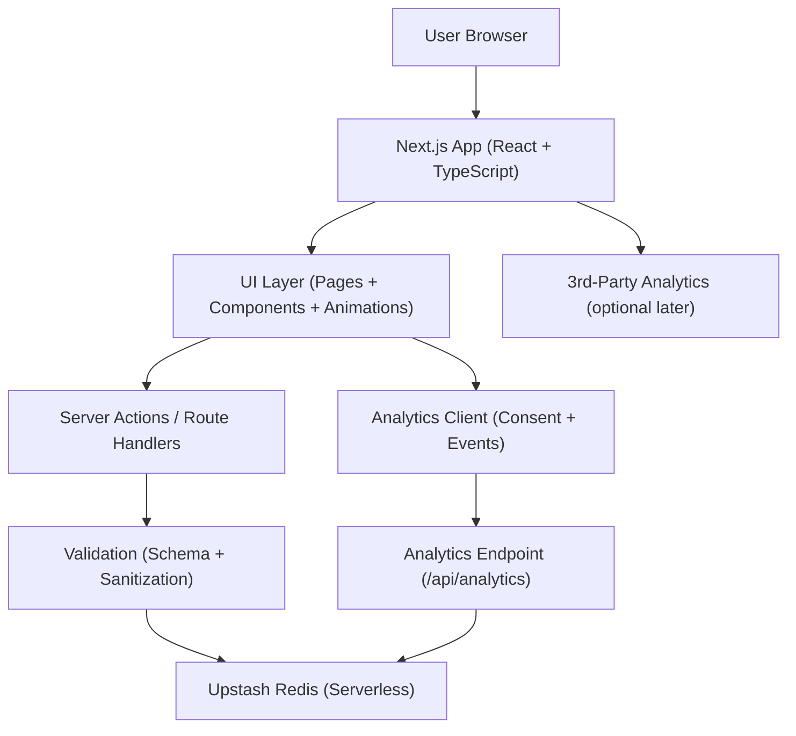
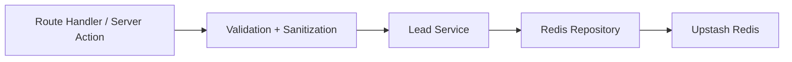

## 1. Architecture Design



## 2. Technology Description
- Frontend/Fullstack: Next.js (App Router) + React + TypeScript
- Styling: Tailwind CSS + CSS variables for theme fidelity with the reference site
- Animation: Framer Motion (primary) + CSS transitions for micro-interactions
- Forms: React Hook Form (optional) or lightweight controlled inputs; include robust client + server validation
- Backend: Next.js route handler or server action to persist leads
- Data store: Upstash Redis (lead storage)
- Analytics (now): first-party event tracking via a lightweight /api/analytics endpoint storing aggregated metrics in Redis
- Analytics (later): pluggable adapters for Firebase (GA4), Google Ads conversion tracking, Meta Pixel, and GTM
- Deployment: Vercel (GitHub connected)

## 3. Route Definitions
| Route | Purpose |
|-------|---------|
| / | Landing page replicating joinnow.planckly.com look/feel, localized for California |
| /privacy | Privacy policy page |
| /terms | Terms page |
| /api/leads | POST endpoint to validate + store leads in Upstash Redis (or implemented as a server action) |
| /api/analytics | POST endpoint to record events (page_view, cta_join_click, lead_submit_click, lead_submit_success) with attribution metadata |

## 4. API Definitions

### 4.1 POST /api/leads
Purpose: create a lead and enroll them into “Free Plan” interest list.

TypeScript schema (conceptual):
```ts
export type CreateLeadRequest = {
  name: string
  email: string
  phone?: string
  plan: "free"
  locale: "en-US"
  region: "US-CA"
  source?: string
  utm?: {
    source?: string
    medium?: string
    campaign?: string
    content?: string
    term?: string
  }
}

export type CreateLeadResponse =
  | { ok: true; leadId: string }
  | { ok: false; error: string; fieldErrors?: Record<string, string> }
```

Validation rules:
- name: required, 2–80 chars
- email: required, valid email
- phone: optional; if provided must match a simple E.164-ish or US phone pattern (tolerant formatting)
- server must enforce rate limiting / basic abuse protection (lightweight, best-effort)

### 4.2 POST /api/analytics
Purpose: record unique visitors and funnel events (views → join clicks → submit clicks/submits) and capture traffic source attribution.

Event naming (chosen to map cleanly to GA4/Firebase later):
- page_view
- cta_join_click
- lead_submit_click
- lead_submit_success

TypeScript schema (conceptual):
```ts
export type AnalyticsEventName =
  | "page_view"
  | "cta_join_click"
  | "lead_submit_click"
  | "lead_submit_success"

export type AnalyticsAttribution = {
  utm_source?: string
  utm_medium?: string
  utm_campaign?: string
  utm_content?: string
  utm_term?: string
  gclid?: string
  fbclid?: string
  msclkid?: string
  ttclid?: string
  referrer?: string
  landing_path?: string
}

export type AnalyticsEventRequest = {
  event: AnalyticsEventName
  visitorId: string
  consent: "granted" | "denied"
  ts: number
  region: "US-CA"
  locale: "en-US"
  attribution?: AnalyticsAttribution
}

export type AnalyticsEventResponse =
  | { ok: true }
  | { ok: false; error: string }
```

Consent strategy:
- If user grants analytics cookies: set a persistent cookie-based visitorId (e.g., plk_vid)
- If user denies: use sessionStorage-only visitorId (no persistent cookie)

Unique visitor counting strategy (Redis-efficient):
- Track unique visitors per day via sets, plus event-specific visitor sets for funnel comparisons

## 5. Server Architecture Diagram



## 6. Data Model

### 6.1 Data Model Definition
Redis key design (namespaced per deployment):
- lead:{leadId} -> Hash with name/email/phone/plan/region/locale/source/createdAt/utmJson
- leads:byCreatedAt -> Sorted Set (score=unixMillis, member=leadId)
Analytics key design (namespaced per deployment and date):
- analytics:uv:{yyyy-mm-dd} -> Set(visitorId)
- analytics:event:{eventName}:{yyyy-mm-dd} -> Set(visitorId)
- analytics:counts:{eventName}:{yyyy-mm-dd} -> Integer (optional, if we want raw counts beyond unique)
- analytics:lastAttribution:{visitorId} -> Hash/JSON storing first/last touch attribution (optional)
- leads:byEmail -> String (key: leads:email:{normalizedEmail} value: leadId) for dedupe

Lead ID format:
- ULID (preferred) or UUIDv4; both work in serverless

### 6.2 Data Definition Language
No SQL migrations required.
Operational notes:
- Configure Upstash Redis via REST token; do all writes on the server (route handler/server action)

Environment variables (Vercel):
- NEXT_PUBLIC_SITE_URL (optional)
- UPSTASH_REDIS_REST_URL
- UPSTASH_REDIS_REST_TOKEN
- LEADS_KEY_PREFIX (e.g., "ca" / "tx" / "uk")
- ANALYTICS_KEY_PREFIX (optional; defaults to LEADS_KEY_PREFIX)

